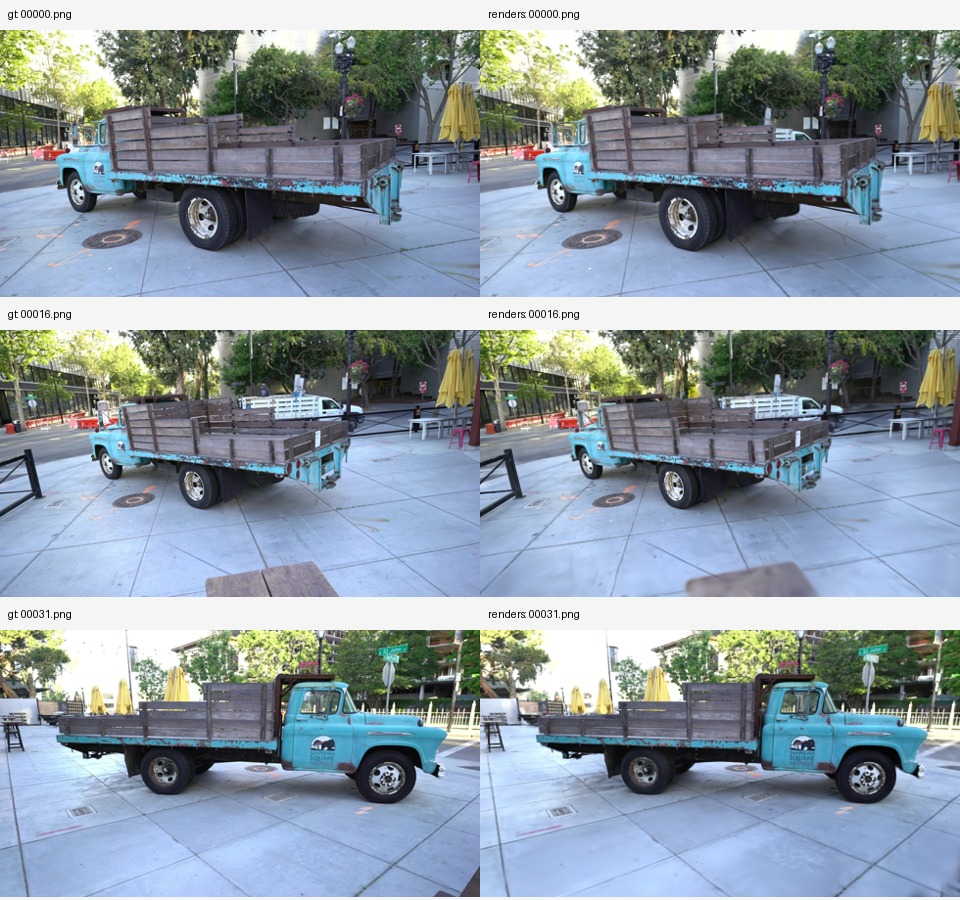

# 3D Gaussian Splatting Reproduction

## 先看成果

**[打开交互式成果展示页 →](https://anon1mo4-21.github.io/3dgs-reproduction/)**

无需登录或启动 GPU。可以切换全部 32 个留出视角，拖动分界线对比真实照片与模型渲染，查看每张图的 PSNR/SSIM，并下载渲染图片与指标。

这是本次实验实际输出的展示页，不是实时三维漫游或上传图片重建服务。网站完整静态源文件保存在 [`showcase/`](showcase/)，本地使用方法见 [展示页说明](docs/showcase.md)。

我在这个仓库中记录官方 3D Gaussian Splatting（3DGS）流程的复现过程，包括环境配置、源码版本、实验命令和结果验证。第一阶段的目标是用一个小型公开多视图场景完成训练，并生成可核验的新视角图像。

## 当前状态

截至 2026-09-10，我已在 Truck 公开场景上完成从稀疏点云初始化开始的 7,000 步训练，并从保存的模型渲染了 32 个未参与高斯优化的留出视角。首个端到端里程碑完成；尚未进行原论文默认 30,000 步配置的定量复现。

- [x] 接入官方实现，固定主仓库及依赖的提交版本。
- [x] 检查本地环境，确认需要远端 CUDA GPU。
- [x] 验证远端 GPU、CUDA 编译器和 PyTorch，并通过 GPU 张量运算检查。
- [x] 将源码与版本记录同步至远端数据盘。
- [x] 编译官方 CUDA 扩展，并通过邻域距离、SSIM 数值/梯度、合成高斯渲染/反向传播检查。
- [x] 准备 Truck 场景，记录数据来源、文件摘要及 219/32 训练/留出视角划分。
- [x] 完成 1,000 步短程检查和独立的 7,000 步训练，保存模型、日志及 32 个留出视角输出。

## 第一阶段结果

两次运行均使用 `--eval -r 2`。指标是官方渲染脚本保存的 RGB PNG 上逐视角 PSNR/SSIM 的均值；未计算 LPIPS。

| 训练步数 | 留出视角数 | PSNR ↑ | SSIM ↑ |
| --- | --- | --- | --- |
| 1,000 | 32 | 22.0829 dB | 0.8121 |
| 7,000 | 32 | 25.1459 dB | 0.9063 |

最终模型包含 1,032,308 个高斯。左列为参考照片，右列为 7,000 步模型渲染；展示固定编号的第一个、中间和最后一个留出视角。



这是使用作者提供的 COLMAP 相机与点云、降低分辨率后的单场景流程复现，不能直接与论文表格比较。数据边界、配置、调试记录和逐视角指标见 [Truck 实验记录](docs/day1-truck.md)。

## 实验环境

| 项目 | 已验证配置 |
| --- | --- |
| GPU | NVIDIA GeForce RTX 4090 D，24564 MiB 显存 |
| 操作系统 | Ubuntu 22.04.1 LTS |
| Python | 3.10.8 |
| PyTorch | 2.1.2+cu118 |
| CUDA Toolkit | 11.8.89 |
| NVIDIA 驱动 | 580.105.08 |
| C++ 编译器 | GCC 11.3.0 |

基础张量运算与扩展最小检查均通过。详细记录见 [GPU 环境检查](docs/day1-gpu-environment.md) 和 [CUDA 扩展构建与验证](docs/day1-extensions.md)；真实场景结果单独记录于 Truck 实验中。

## 源码与复现范围

我将 [官方实现](https://github.com/graphdeco-inria/gaussian-splatting) 作为 Git 子模块放在 `third_party/gaussian-splatting`，固定提交为 `54c035f7834b564019656c3e3fcc3646292f727d`。完整依赖版本见 [版本记录](records/upstream-versions.txt)。

该提交包含论文发布后的更新。本阶段旨在跑通固定版本的官方流程；在完成数据划分、参数与指标对齐之前，我不会将结果视为原论文定量结果的严格复现。当前使用的 Python/PyTorch 环境也与官方原始 environment.yml 不同，兼容性以实际编译和运行结果为准。

获取源码：

```bash
git clone https://github.com/aNon1mo4-21/3dgs-reproduction.git
cd 3dgs-reproduction
git submodule update --init third_party/gaussian-splatting
git -C third_party/gaussian-splatting submodule update --init --recursive submodules/diff-gaussian-rasterization submodules/simple-knn submodules/fused-ssim
```

以上命令只获取源码，不安装运行依赖。可选 SIBR 查看器暂不初始化；上游代码适用其自身许可证，见 `third_party/gaussian-splatting/LICENSE.md`。

## 实验记录

- [本地环境检查与源码接入](docs/day1-environment.md)
- [远端 GPU 环境验证](docs/day1-gpu-environment.md)
- [CUDA 扩展构建与验证](docs/day1-extensions.md)
- [Truck 训练、留出视角渲染与评估](docs/day1-truck.md)
- [官方实现与子模块版本](records/upstream-versions.txt)

后续我会随实验更新数据来源、运行命令、参数、输出路径和失败记录，使每个阶段的结论都有对应证据。
